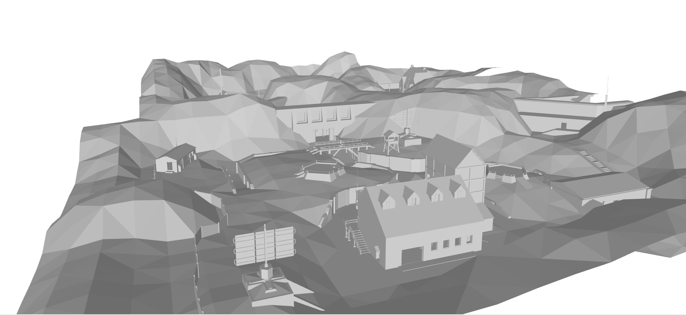
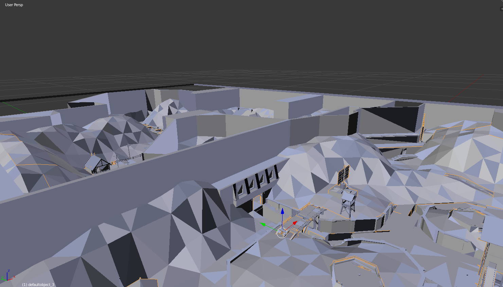
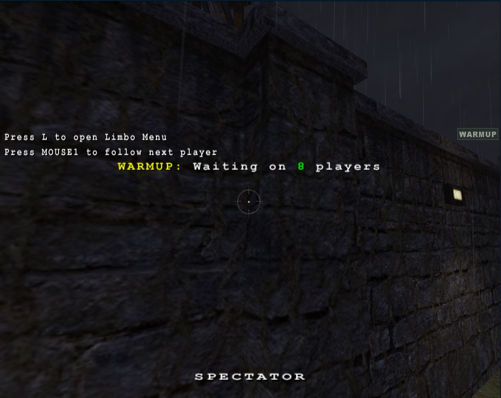
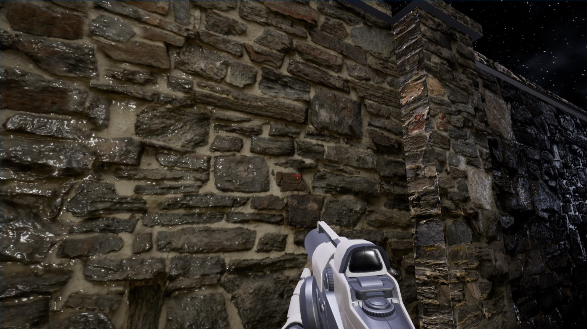

## Enemy Territory Map Converter

This project was done purely as learning and fun endeavor, it has plenty of issues. The goal was to convert [Wolfenstein: Enemy Territory's](https://www.splashdamage.com/games/wolfenstein-enemy-territory/) variation of the quake .map format into an obj/mtl format that can be used in other platforms using this article from [quakewiki.org](https://quakewiki.org/wiki/Quake_Map_Format) as a reference. 

### Objects
The type of objects included in the convertion can be filtered out in options.ini. In my tests i filtered out everything that was a dynamic object or not part of the basic geometry such as clip walls.

### Testing on the map Radar

Geometry Preview:\
\

On blender:\
\

Unfinished UE4 preview:\
Original:\
\
UE4:\
\
Gif preview:\
